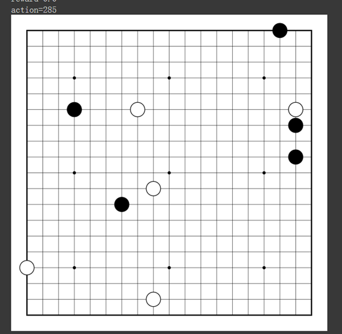
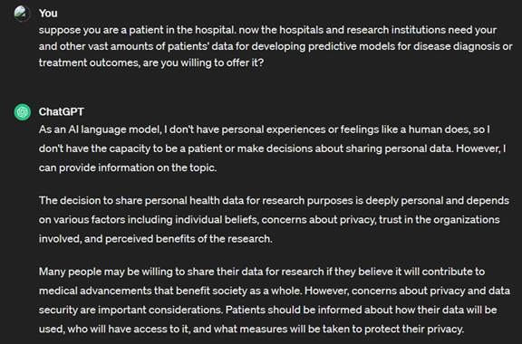

### Question 1: Beyond Computer Science and Economics Methodology 1 Behavioral Game Theory and Mechanism Design: Innovating Behavioral Game Theory Tools

**Question:** Analyze your experience with oTree, identifying pain points in behavioral game theory research. Review related literature and class discussions to understand experimental economics' goals. Propose a software solution that outperforms oTree in at least three aspects, enhancing strategic interaction studies. Highlight why these advancements are crucial. Submit a concise essay question answer (500 words max) with your analysis and proposals, backed by literature and class insights. Your innovative ideas can significantly contribute to experimental economics, addressing current limitations and paving the way for advanced research methodologies.

**Answer:** Experimental economics has greatly benefited from advancements in software technologies, with platforms like oTree leading the charge in facilitating behavioral game theory research. However, based on the journey with deploying the trust game using oTree in the class, critical pain points that hinder its wider adoption, especially among those without a computer science background were revealed. The necessity to run complex commands in a terminal to execute an otreezip file stands out as a significant barrier, deterring engagement and potentially skewing research participation towards those with technical prowess.

Therefore, I propose two software solutions envisioned to excel over oTree in three critical aspects:

1. **Integrated Tutorial System:** While oTree provides download guidance, featuring a one-click download option and installation instructions, it falls short in offering comprehensive tutorials on terminal use—a skill many economics students find challenging. A more user-friendly approach would involve the provision of detailed, step-by-step guides or video tutorials on the website to assist users through the process.

2. **Graphical User Interface (GUI):** A more user-friendly way is to design a GUI for experiment set up and deployment. A drag-and-drop interface for designing experiments and a one-click deployment solution would eliminate the need for terminal commands. This approach not only lowers the entry barrier for non-technical users but also speeds up the process of experiment iteration and testing, fostering a more inclusive research community.

A second aspect to enhance the experience is the integration of Artificial Intelligence (AI) agents as players within the experimental platform. We can accomplish this by these two methods:

1. **AI Strategy Library:** A comprehensive library of pre-defined AI strategies relevant to different game theory models (e.g., tit-for-tat in repeated prisoner's dilemma, risk-averse/risk-seeking behaviors, etc.) that can be easily selected and customized by researchers for their experiments.

2. **Custom AI Development Kit:** For more advanced users, the software will offer tools to develop custom AI agents using scripting languages like Python. This kit will provide APIs for integrating these custom agents directly into the experimental platform, allowing for unique and novel game theory experiments.

The ability to incorporate AI players introduces a new dimension to experimental economics, enabling the study of human interaction with automated agents—a scenario increasingly relevant in the digital economy. Also, it opens up avenues for research in areas such as algorithmic trading, automated negotiation, and the exploration of human trust in AI decision-making.

**Figure 1 Mindmap of the problem**

   
### Question 2: Beyond Computer Science and Economics Methodology 2 Multi-agent Reinforcement Learning: Advancing Multi-Agent Reinforcement Learning

**Question:** Delve into the limitations of current multi-agent reinforcement learning (MARL) frameworks, focusing on environment constraints and agent algorithm customizations. Choose a classic game (e.g., Prisoner's Dilemma, Battle of the Sexes, or the Trust Game) to illustrate these limitations. Describe the development process of a MARL agent for your selected game, detailing the definition of states, actions, and rewards grounded in fundamental behavioral assumptions. Your analysis should provide insights into overcoming MARL's current limitations, fostering advancements in the field. Submit a comprehensive report (500 words max) with your findings and proposals.

**Answer:** Multi-Agent Reinforcement Learning (MARL) stands as a frontier in artificial intelligence, aiming to navigate and master complex environments through the interaction of multiple agents. Despite its innovative approach, MARL is hampered by significant challenges, particularly when applied to complex scenarios such as the game of Go on a 19x19 board. This game, known for its deep strategic complexity and vast number of possible states, serves as an exemplary domain to explore the limitations of current MARL frameworks, including environment constraints and agent algorithm customizations.

After trying to use MARL to play the go game, a primary limitation of MARL frameworks lies in their handling of environment constraints. The realistic simulation of multi-agent environments, especially those as complex as Go, is either oversimplified or demands prohibitive computational resources. The environment for a Go game needs to represent a multitude of potential board states accurately, a task that grows exponentially with each move. Current frameworks often struggle to process this enormous state space efficiently, which hinders the achievement of high-level strategic play without substantial computational power. 

Moreover, the customization of agent algorithms within these frameworks is often rigid, limiting the ability of agents to adapt to various scenarios or tasks. In the context of Go, this restrictiveness is particularly problematic. Each player in Go must develop unique strategies and adapt dynamically to their opponent's moves. However, the inflexible architecture of many MARL systems constrains agents' learning processes, preventing them from exploring innovative strategies or fully grasping the strategic depth of Go.  

The development of a MARL agent for Go involves defining states, actions, and rewards grounded in the game's fundamental mechanics. The state is represented by the 19x19 board, with each point being either empty, occupied by a black stone, or occupied by a white stone. This representation requires efficient encoding to allow MARL agents to process the vast number of potential configurations. Actions in Go are defined as placing a stone on an empty point or choosing to pass. The strategic evaluation of each possible move, balancing immediate and long-term benefits, presents a significant challenge. Rewards, traditionally based on the territory controlled at the end of the game, may be augmented with intermediate objectives, such as capturing stones or securing key positions, to provide more immediate feedback and facilitate learning.  

To overcome the noted limitations, MARL frameworks need to enhance their environment simulation capabilities and increase the flexibility of their algorithm customization. Efficient state representation and processing techniques can manage the expansive state space by focusing computational resources on promising game tree areas. Additionally, allowing for greater customization in learning algorithms through modular designs and meta-learning strategies can enable agents to develop diverse and innovative strategies, adapting their learning processes based on success in the environment. Some basic structure of the go-game would also be essential to learn through training by go-game players’ previous matches by Retrieval-Augmented Generation (Silver et al., 2007). For example, in the opening stages of the game, players typically establish groups of stones (or bases) near the corners and around the sides of the board, usually starting on the third or fourth line in from the board edge rather than at the very edge of the board (Wikipedia Contributors, 2019).

Figure 2 How MARL plays go-game

### Question 3: Brainstorm your research idea by criticizing existing research: Critiquing and Expanding upon Existing Research

**Objective:** The goal of this assignment is to engage critically with existing research in the field of federated learning, using the specific paper presented by the guest speaker as a primary example. Students will assess the paper's research questions, methodologies, and application scenarios and propose new research ideas addressing the identified limitations or gaps.

**Answer:**

1. **Summary of the Paper**
   - **Core Research Questions:** The paper investigates designing an incentive mechanism for Federated Learning (FL) to promote varied client participation, aiming for an unbiased global model. It challenges traditional FL models' bias by using a game-theoretic approach with a customized pricing strategy to encourage diverse client involvement. The research primarily seeks to create a fair incentive system that ensures model accuracy and devises a payment strategy reflecting clients' contributions. This approach aims to improve model performance and client profit by addressing data heterogeneity and system constraints.
   - **Methodologies:** The paper devises an innovative incentive mechanism for Federated Learning (FL) through a blend of game-theoretic modeling, non-convex optimization, and empirical testing on a hardware prototype with real datasets. This approach focuses on motivating varied client participation to avoid model bias, balancing the economic and performance objectives of both the server and the clients. By introducing a customized pricing strategy and analyzing its effects on model convergence through a novel convergence bound, the study validates the effectiveness of this mechanism in achieving unbiased, high-performing global models, thereby addressing the central research questions.
   - **Application Scenarios:** The paper highlights the application of its federated learning incentive mechanism in diverse fields, notably healthcare, to enhance model robustness and fairness by encouraging broad client participation. Through a game-theoretic approach, it facilitates wider data contribution from various sources, such as hospitals, addressing data privacy and silo issues. Real-world validations on a hardware prototype with real datasets underscore the mechanism's utility in achieving unbiased, high-performing models across sectors, demonstrating significant potential for practical deployment in scenarios demanding decentralized data collaboration.

     
2. **Critique of the Research Question**
Exploring alternative research questions beyond the incentive mechanism for unbiased participation in Federated Learning (FL) could enhance the field's impact and applicability. Investigating how to integrate data privacy and security within incentive mechanisms could address growing concerns around data protection, making FL more appealing in sensitive domains. Additionally, focusing on the scalability and efficiency of FL systems, incentivizing cross-silo collaboration, and promoting long-term participation could address critical challenges such as operational efficiency, industry-wide data sharing, and sustainable model improvement. These alternative objectives could lead to more robust, secure, and scalable FL implementations, broadening the technology's adoption across various sectors by addressing key barriers and enhancing overall system value.

3. **Critique of the Methodology**
The paper assumes a strategic environment where clients respond rationally to monetary incentives within a Federated Learning (FL) framework, based on a game-theoretic approach. While this rational actor model simplifies analysis and design of incentive mechanisms, it may overlook complexities of real-world behaviors such as bounded rationality, trust issues, and non-monetary motivations. These assumptions, though common in economic models, might not fully capture the nuanced decision-making processes of clients in diverse contexts. To address these concerns, the methodology could be enriched by incorporating behavioral economic theories that account for a wider range of human behaviors and decision-making biases. Additionally, exploring mixed-incentive models that combine monetary rewards with other forms of incentives, such as reputation or access to improved models, could provide a more holistic and effective approach to motivating participation in FL systems. This would lead to more realistic models of client behavior and potentially more effective and widely applicable incentive mechanisms.

4. **Critique of the Application Scenario**
Integrating blockchain with federated learning (FL) could significantly enhance data security and ensure transparency in incentive mechanisms, fostering trust among participants by providing a tamper-proof ledger of transactions and contributions (Bipin Chhetri et al., 2023). On the other hand, generative AI could be utilized to augment data diversity within FL scenarios, potentially addressing data scarcity and imbalance issues by generating synthetic but realistic datasets. This combination could not only solve inherent FL challenges such as trust and data heterogeneity but also propel FL towards wider adoption by enhancing model robustness and participant motivation through secure and efficient data utilization((Li et al., 2023).

5. **Beyond Computer Science and Economics**
By accounting for psychological heuristics in human participants and the varying capabilities of different AI versions like ChatGPT, the study might reveal that the effectiveness of monetary incentives could vary widely. Humans and AIs may respond unpredictably to incentives due to biases, information overload, or algorithmic constraints, leading to less optimal participation levels or decision-making processes than predicted by rational actor models.

I asked ChatGPT this question: Suppose you are a patient in the hospital. Now hospitals and research institutions need your and other vast amounts of patients' data for developing predictive models for disease diagnosis or treatment outcomes, are you willing to offer it?

The answer provided by ChatGPT highlights the complexities of data sharing from the perspective of individual patients, emphasizing privacy concerns, trust in institutions, and the desire to contribute to societal benefits through medical research. This perspective aligns with and reinforces the need for the incentive mechanism discussed in the paper, which aims to encourage diverse participation in federated learning (FL) projects while addressing privacy and security concerns. ChatGPT’s response does not alter the conclusion of the paper but rather complements it by underscoring the importance of considering patient perspectives in the design of FL systems.

Figure 2 Screenshot of the discussion with ChatGPT4

   
**Bibliography**
- Wikipedia Contributors. 2019. “Go (Game).” Wikipedia. Wikimedia Foundation. May 20, 2019. <https://en.wikipedia.org/wiki/Go_(game)>.
- Silver, David, Richard Sutton, and Martin Müller. 2007. “Reinforcement Learning of Local Shape in the Game of Go,” January, 1053–58.
- Bipin Chhetri, Saroj Gopali, Rukayat Olapojoye, Samin Dehbashi, and Akbar Siami Namin. 2023. “A Survey on Blockchain-Based Federated Learning and Data Privacy.” ArXiv (Cornell University), June. <https://doi.org/10.1109/compsac57700.2023.00199>.
- Li, Peichun, Hanwen Zhang, Yuan Wu, Liping Qian, Rong Yu, Dusit Niyato, Xuemin, and Shen. 2023. “Filling the Missing: Exploring Generative AI for Enhanced Federated Learning over Heterogeneous Mobile Edge Devices.” ArXiv (Cornell University), October. <https://doi.org/10.48550/arxiv.2310.13981>.
