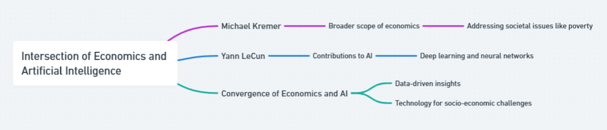
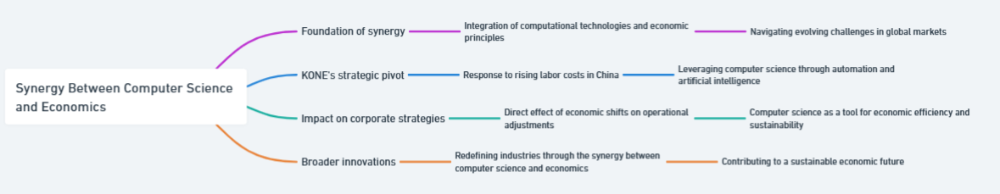
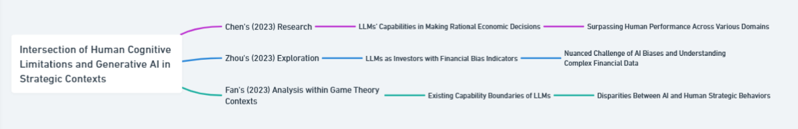

# CS & Econ: Intersections for Advancing Civilization

## 1. When Computer Science Meets Economics

**Question:** When computer science meets economics: Who do you truly want to become? Pick one of your favorite Nobel Prize winners [Nobel Prize](https://www.nobelprize.org/) and Turing Award winners [Turing Award](https://amturing.acm.org/). How do you want to contribute to the intersection of the two north stars to advance human civilizations?

**Answer:** In contemplating who I aspire to become at the nexus of economics and artificial intelligence (AI), I draw inspiration from the profound insights of Nobel Prize winner [Michael Kremer](https://www.nobelprize.org/prizes/economic-sciences/2019/kremer/interview/) and Turing Award recipient [Yann LeCun](https://amturing.acm.org/award_winners/lecun_6017366.cfm). Kremer's emphasis on the broader scope of economics, beyond the stock market, resonates deeply with my belief in the discipline's potential to address pressing societal issues like poverty. His perspective underscores the importance of harnessing economics as a tool for tangible, real-world impact, aligning with my own aspirations to contribute meaningfully to human civilization. Meanwhile, LeCun's groundbreaking contributions to AI, particularly in deep learning and neural networks, illuminate the transformative power of technology in driving innovation across diverse domains, including finance. By amalgamating Kremer's advocacy for addressing practical problems and poverty with LeCun's advancements in AI, I envision a future where data-driven insights and cutting-edge technologies converge to tackle complex socio-economic challenges. My aspiration is to leverage AI-driven solutions to enhance our understanding of economic dynamics, facilitate more effective policy interventions, and ultimately, advance human civilization towards a more equitable and prosperous future.(Check Figure 1 for Mindmap)

Figure 1: Mindmap of Question 1

## 2. CS&Econ for a Better Future

**Question:** How do you perceive the synergy between computer science and economics as a catalyst for steering innovation toward a brighter future? Please present a foundational assertion, followed by multiple specific instances that support your claim, including a reference to a topic discussed at the colloquium on Friday, March 22.

**Answer:** The synergy between computer science and economics acts as a powerful catalyst for steering innovation towards a brighter future, exemplified through the adaptive strategies of global corporations like KONE Elevator in China. The foundational assertion here is that the harmonious integration of computational technologies and economic principles enables organizations to navigate the evolving challenges of global markets effectively. Initially drawn to China by the allure of cheap labor, KONE found itself at a crossroads as economic growth transformed this advantage into a fiscal burden due to rising labor costs. This situation underscores the dynamic nature of global economic advantages and the imperative for businesses to evolve strategically to maintain competitiveness.  In response, KONE's contemplation of leveraging computer science through automation, artificial intelligence, and other technologies illustrates a strategic pivot aimed at countering the economic challenge of increased labor costs. This adaptation not only showcases the direct impact of economic shifts on corporate strategies but also highlights how computer science serves as a vital tool for economic efficiency and sustainability. Thus, the intersection of computer science and economics does not merely facilitate operational adjustments for companies like KONE but also drives broader innovations that have the potential to redefine industries and contribute to a sustainable economic future. This synergy, therefore, is a testament to the potential of combining computational innovations with economic strategies to address and overcome challenges, illustrating a path forward where technology and economics together foster a landscape ripe for breakthroughs and advancements.(Check Figure 2 for Mindmap)

Figure 2: Mindmap of Question 2

## 3. Beyond CS & Econ

**Question:** Beyond CS & Econ: How are aspects of human nature, like bounded rationality, and pioneering technologies, such as generative AI, reshaping the dynamics between humans and AI agents in strategic contexts? Additionally, how might this interplay be perceived and conceptualized distinctively from current models? Address this inquiry by drawing upon the literature covered in our lectures and supplementary scholarly works, ensuring to include in-text citations and a comprehensive bibliography.

**Answer:** The intersection of human cognitive limitations and the advent of generative AI technologies, particularly in strategic contexts, heralds a complex redefinition of the dynamics between humans and AI agents. This transformation is underscored by studies exploring the economic and financial rationality of Large Language Models (LLMs) alongside their potential as rational players in game theory. [Chen's (2023) research](https://doi.org/10.1073/pnas.2316205120) illustrates LLMs' capabilities in making rational economic decisions, often surpassing human performance across various domains. This suggests an emerging paradigm where AI could potentially mitigate human bounded rationality in decision-making processes. Concurrently, [Zhou's (2023) exploration into LLMs as investors](https://doi.org/10.48550/arXiv.2402.12713), with the introduction of Financial Bias Indicators, reveals the nuanced challenge of AI biases and their understanding of complex financial data. This highlights the dichotomy of AI's rationality—its potential to transcend human cognitive limitations juxtaposed with its susceptibility to different biases that can affect decision-making in strategic financial contexts.  Furthermore, [Fan's (2023) systematic analysis within game theory contexts](https://doi.org/10.48550/arXiv.2312.05488) elucidates the existing capability boundaries of LLMs, revealing substantial disparities between AI and human strategic behaviors. This not only reflects on AI's current limitations in mimicking the full spectrum of human rationality but also cautions against an uncritical integration of AI in strategic decision-making frameworks. Collectively, these studies compel a reevaluation of current models that govern the human-AI interface in strategic contexts, suggesting a shift towards models that not only leverage AI's strengths in enhancing rational decision-making but also acknowledge and mitigate its inherent biases and limitations. This nuanced interplay between human nature and generative AI necessitates a conceptual evolution, moving beyond traditional frameworks to accommodate the complexities introduced by AI in strategic decision-making landscapes.(Check Figure 3 for Mindmap)

Figure 3: Mindmap of Question 3

## References

- “The Sveriges Riksbank Prize in Economic Sciences in Memory of Alfred Nobel 2019.” n.d. NobelPrize.org. Accessed March 24, 2024. [https://www.nobelprize.org/prizes/economic-sciences/2019/kremer/interview/](https://www.nobelprize.org/prizes/economic-sciences/2019/kremer/interview/).
- “Yann LeCun - A.M. Turing Award Laureate.” n.d. Amturing.acm.org. [https://amturing.acm.org/award_winners/lecun_6017366.cfm](https://amturing.acm.org/award_winners/lecun_6017366.cfm).
- Chen, Yiting, Tracy Xiao Liu, You Shan, and Songfa Zhong. 2023. “The Emergence of Economic Rationality of GPT.” Proceedings of the National Academy of Sciences of the United States of America 120 (51). [https://doi.org/10.1073/pnas.2316205120](https://doi.org/10.1073/pnas.2316205120).
- Zhou, Yuhang, Yuchen Ni, Xiang Liu, Jian Zhang, Sen Liu, Guangnan Ye, and Hongfeng Chai. 2024. “Are Large Language Models Rational Investors?” ArXiv.org. February 19, 2024. [https://doi.org/10.48550/arXiv.2402.12713](https://doi.org/10.48550/arXiv.2402.12713).
- Fan, Caoyun, Jindou Chen, Yaohui Jin, and Hao He. 2023. “Can Large Language Models Serve as Rational Players in Game Theory? A Systematic Analysis.” ArXiv.org. December 12, 2023. [https://doi.org/10.48550/arXiv.2312.05488](https://doi.org/10.48550/arXiv.2312.05488).
