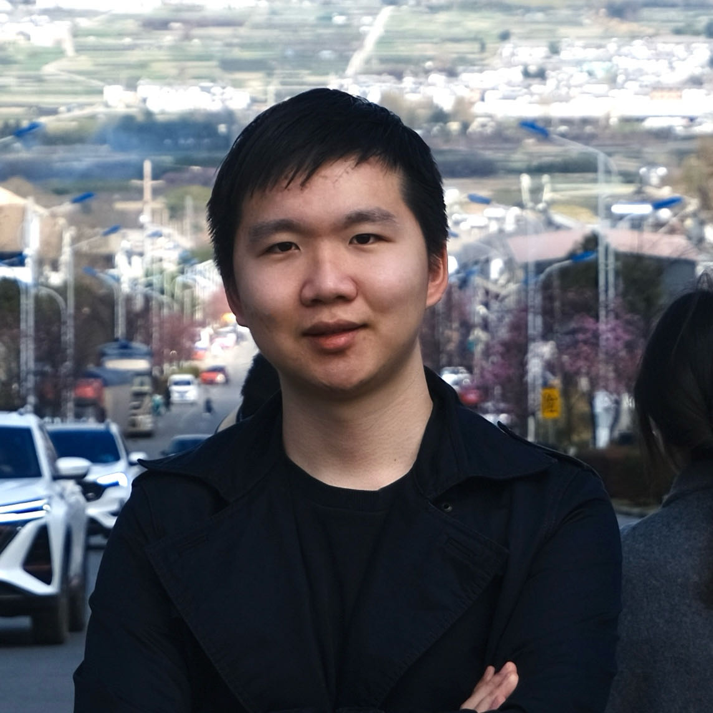

### Hi there 👋

# Guangzhi (Allen) Su

Welcome to my GitHub! I'm Allen, a sophomore student at Duke Kunshan University (DKU), pursuing a major in Applied Mathematics and Computer Science. With a passion for fostering collaborative and learning environments, I've taken up roles that allow me to contribute significantly to the student community and beyond.

## Education 🎓

- **Duke Kunshan University (DKU)**
  - B.S. in Applied Mathematics and Computer Science
  - Class of 2026

## Leadership and Community Engagement 🌟

- **Founding President**, DKU Finance Club
- **Co-Founder**, DKU Computer Science Club
- **Student Worker**, Duke Kunshan University Colloquium Committee (UCC)

Through these roles, I aim to nurture a space where students can collaborate, share knowledge, and grow together in their academic and professional journeys.

## Internships and Professional Experience 💼

- **Upcoming Summer Intern at CEI lab at Duke University**
  - Summer Intern under Prof. Yiran Chen, focusing on Large Language Model research
- **Microsoft-INESA AI Innovation Center**
  - Intern, specializing in Natural Language Processing
- **Energy Innovation Capital (EIC)**
  - Extern in venture capital, data analysis
- **KPMG China**
  - Intern in financial accounting

## Social Impact and Collaborations 🌍

- Collaborated with **Nike** to enhance sports experiences for Chinese young adults
- Participated in the **Millennium Fellowship** with the United Nations, focusing on sustainable development goals

## Repository Introduction
This GitHub repository is dedicated to housing my responses and solutions to Problem Set 1 for the **COMPSCI/ECON 206 Computational Microeconomics** class, taught by **Prof. Luyao Zhang** at DKU. It is structured to not only showcase my solutions to the intricate problems posed in the class but also to highlight my personal methodology, insights, and the innovative strategies I employed. Through the organization of each folder and file, visitors can trace my thought process and proficiency in applying computational techniques and economic theory to solve complex microeconomic problems.

## Table of Contents

1. [Reflection on Milestone 1](#reflection-on-milestone-1)
2. [Reflection on Milestone 2](#reflection-on-milestone-2)

## Reflection on Milestone 1

For details on the first milestone, see the documents and resources in [CSEcon](./CSEcon/).

## Reflection on Milestone 2

For details on the second milestone, see the documents and resources in [Advance_CSEcon](./Advance_CSEcon/).

## Connect with Me 📫

For more about my projects, professional experiences, and collaborations, feel free to connect with me on [LinkedIn](https://www.linkedin.com/in/allen-guangzhi-su-苏广智-613070244/).

